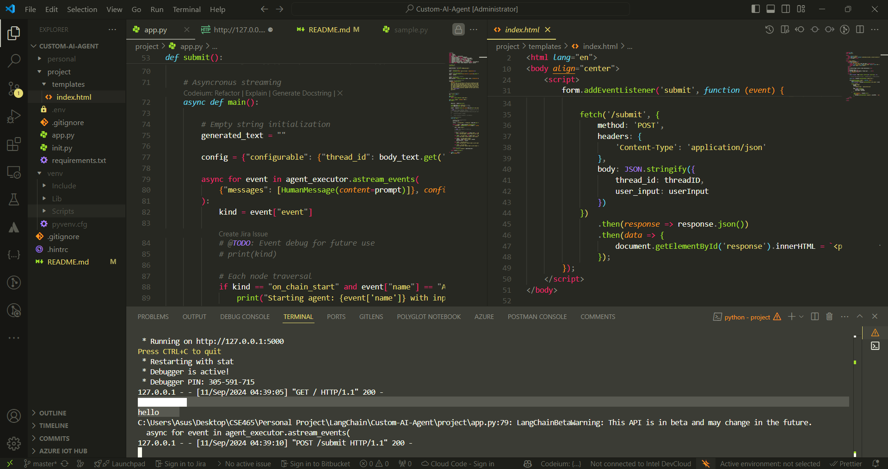

## Custom AI Agent

This project demonstrates a custom AI agent that responds to user inputs based on preferences and searches. Flask is used as the backend, JavaScript is used for client-side interaction, and the LangChain framework is used for the assistant. Also here used a thread ID that allows the AI agent to track user sessions and manage asynchronous requests.

#### Visit Custom AI Page: [Click Here](https://custom-ai-agent.onrender.com)

_<sub>**Note:** As here used Render for free deployment service, it may get idle after few moments. Implemented here continuous intergration (CI) to on Git actions to keep the Render service alive. If it still shows inactive please let me know.</sub>_<br>



## Key Features

- **Thread ID Management:** To keep track of the context of the conversation, a unique thread ID is generated for every session. As a result, the AI agent is able to retain user preferences throughout the session.

- **Asynchronous Processing:** The AI assistant is effective for lengthy or complicated queries because it handles streaming responses using asynchronous techniques.

- **Tavily Search API:** To improve the assistant's functionality, this project incorporates a search tool (TavilySearchResults).

- **Render Deployment:** The repository was deployed into Render Web Services.

## Requirements

Here `requirement.txt` was included into project folder, also following dependencies are required:

- Python 3.11 or above (For Asyncronus Streaming)
- Flask
- LangChain
- OpenAI API
- Dotenv
- asyncio
- TavilySearch API

## Project Setup

- The project uses .env to store API keys securely.

```
OPENAI_API_KEY = "API"
TAVILY_API_KEY = "API"
```

- Use `requirements.txt` to install required dependencies.

- Run `app.py` using Flask Server.

```
python app.py
```

- The server will start at `http://127.0.0.1`

## Functionality

- Here Flask server (`http://127.0.0.1`) manages the POST requests for interaction with the AI agent and it was tested on the local server.

- The simple HTML page sends user input to the Flask backend using JavaScript.

- A random thread ID is generated to track each session, allowing the AI to remember preferences.

- The AI assistant uses the LangChain framework and OpenAI's GPT-3.5-Turbo model to process user input and provide pertinent information in response.

- Quick answers to user inquiries through by asynchronous streaming.
